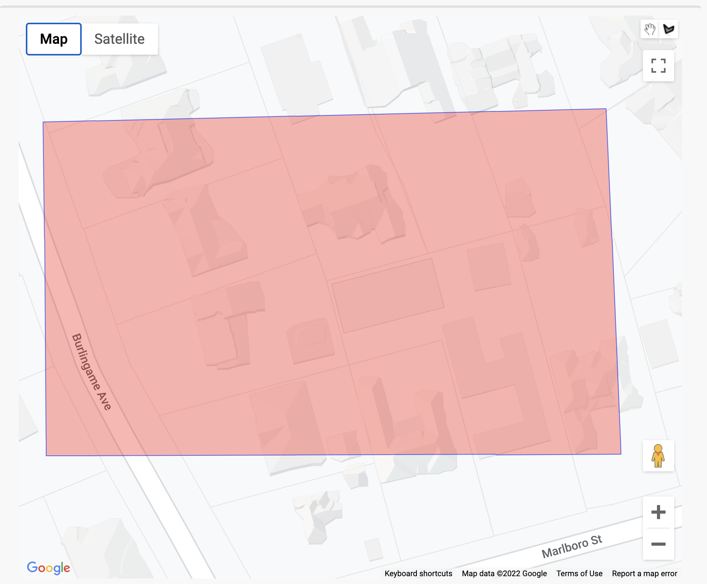
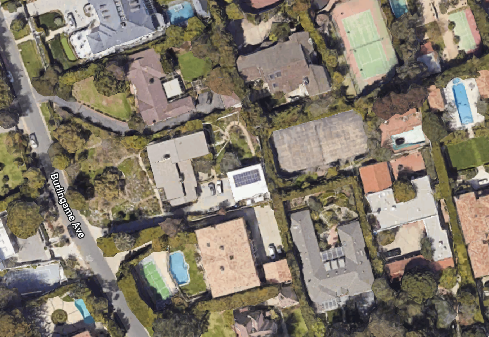
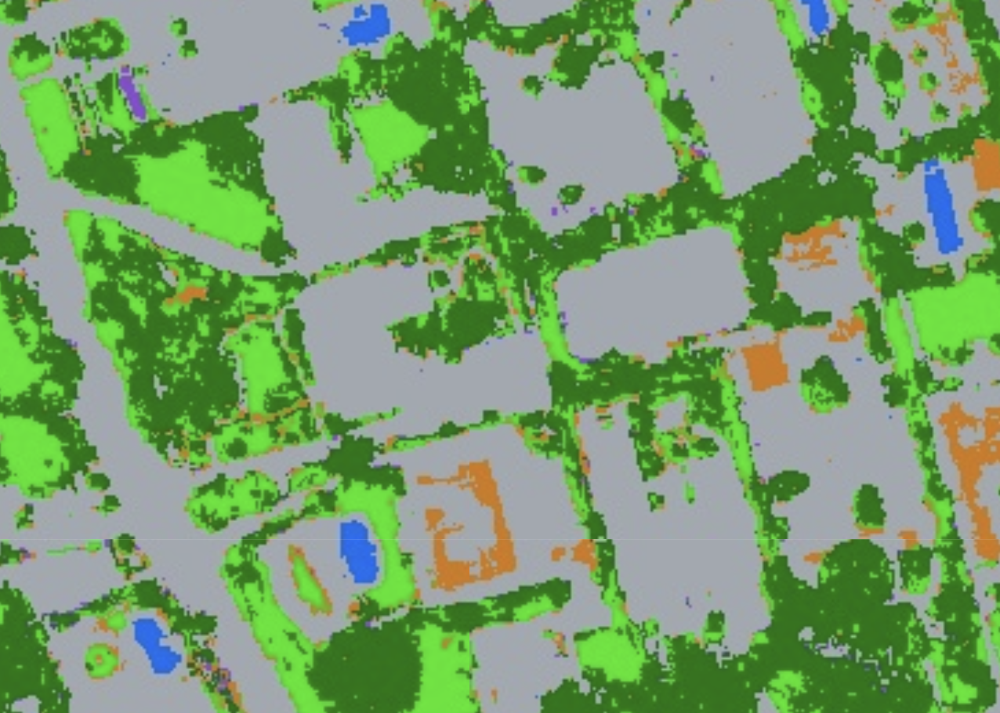
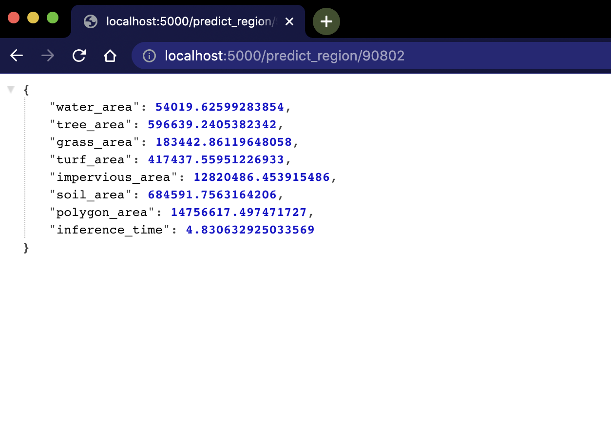
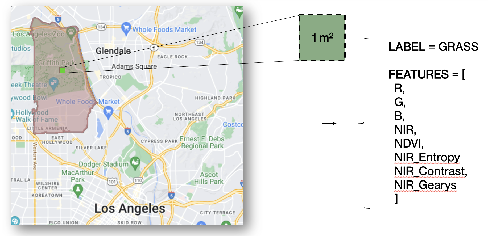
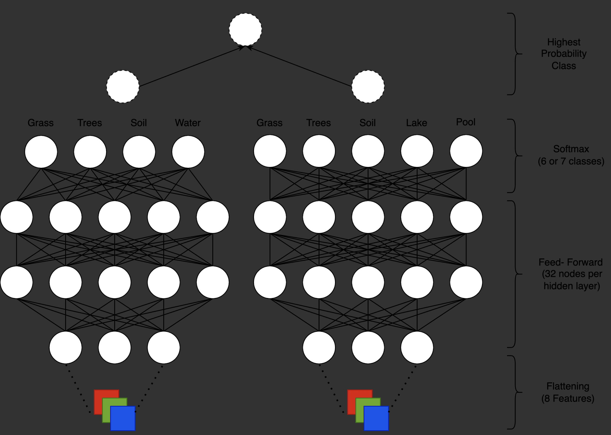

# Urban Insights

This is the code repository for [Urban Insights](https://www.urbaninsights.ai/). Urban Insights is a landcover classification and urban planning tool developed as part of the UC Berkeley MIDS Capstone course.

Our mission is to identify irrigated vegetation including lawns and trees along with other land cover including water, soil, and impervious surfaces. Using geographical data, aerial imagery, and advanced ML techniques, the primary objective is to provide insights to support policies and plans aimed at reducing water usage with minimal adverse effects on urban microclimate and accounting for median household income in the process.

## [notebooks](./notebooks)
Includes majority of code for running the backend application, model training, evaluation, data generation and use case analysis.

## [webapp](./webapp)
Includes code for the [Insights Analyzer](https://carlos-ortiz.shinyapps.io/webapp/) web application.

## [PanelDataModels](./PanelDataModels)
Includes regression model code and plots used for analysis and for our research paper.

## [www/html](./www/html)
Includes HTML code for our website.

## [api](./api)
Includes the FastAPI code which serves as the backend for our web application

 

### Contributors

W210 Capstone Project Team: Diana Chacon, Sudhrity Mondal, Carlos Ortiz-Gomez, Jorge Dayer, Vaishali Khandelwal, Hassan Saad, Sam Temlock

## Classifying Landcover Using Aerial Imagery and TensorFlow

*The first step in solving a problem is measuring the problem.*

### Background/ Motivation

This project is focused on classifying different kinds of landcover (e.g. water, soil, grass, trees, manmade materials) by leveraging Google Earth Engine's (GEE) Python API. After classification, the results can be aggregated to measure the corresponding areas.

Below are a few potential use cases:
* Calculating forest areas to measure year over year deforestation trends in the Amazon
* Quantifying water body area to measure drought severity in the American Southwest
* Understanding urban development trends and allowing for more thoughtful planning/ construction

Our team focused on a use case closer to home. We calculated lawn area in Southern California to understand changes over the last decade and motivate policy change geared towards the drought crisis.

**This repository consists of the code we wrote to combine Google Earth Engine tools with FastAPI. We built the backend for a web app that allows a user to define a custom polygon or zip code and extract the corresponding landcover areas in the defined region.**

### Data and Methodology:

A user can start by selecting a customer polygon that they're looking to analyze.

  

The TensorFlow model will run inference on the selected area and create a new image array that represents the label of each pixel in the original image (0 for water, 1 for trees, etc.). Below we show a Google Maps satellite image on the left and the corresponding classified image on the right.

  
  

The API will also return a JSON object representing the area (in square meters) of each type of landcover in the polygon.

  

Rather than classifying entire images, our approach entails pixel-level classification. Each pixel in the source image represents a 1 square meter plot of land, and is characterized by 4 different channels- Red, Green, Blue, and Near Infrared (NIR)- which act as baseline features for each sample.

We perform various transformations on these 4 baseline channels to engineer additional features (NDVI, entropy, etc.). This yields us an 8 -feature sample, which we feed into our TensorFlow model upon inference. These classified pixels then get counted to output the corresponding area for each type of landcover in the selected region.

  

Our model consists of an ensemble Neural Net, more specifically a Convolutional Neural Net with a kernel size of 1x1. This is necessary due to the format in which GEE provides their data, and it allows us to unpack the stacked image channels into a 1-dimensional array which we can use in a feed-forward network. The highest probability class from the two models is selected as the ultimate label for the pixel.

  

Our final model achieves an average macro F1 score of 0.92 across all 7 different classes.
